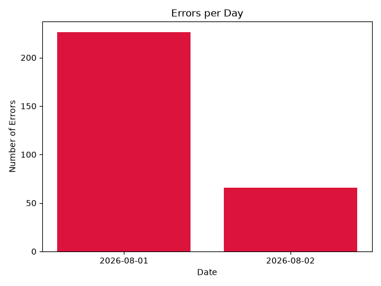
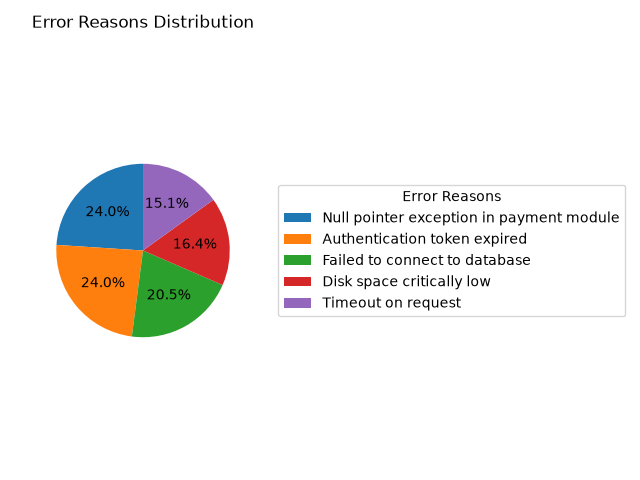

# Log Analyzer

A command line tool that parses log files, validates entries, and generates visual summaries of error patterns — built to practice real-world Python: file I/O, regex validation, and data visualization.

## What it does

- Parses any log file and validates each line against an expected format using regex
- Counts log entries by severity (ERROR / WARNING / INFO)
- Tracks how many errors occurred per day
- Identifies the most frequent error message
- Generates a bar chart of errors per day
- Generates a pie chart showing the breakdown of error reasons
- Safely skips and reports malformed/invalid lines instead of crashing or silently miscounting

## Example output
Total lines in log file: 500

Log level breakdown:
ERROR: 292
WARNING: 123
INFO: 85

Most common error: "Null pointer exception in payment module" occurred 70 times.

Errors per day:
2026-08-01: 226 errors
2026-08-02: 66 errors

Chart saved as errors_chart.png
Pie chart saved as error_reason_pie.png

### Errors per day


### Error reasons breakdown


## How to run it

```bash
# Set up a virtual environment
python3 -m venv venv
source venv/bin/activate

# Install dependencies
pip install matplotlib

# Run on any log file
python analyzer.py sample.log
```

## Generating sample data

A log generator script is included to produce realistic test data:

```bash
python generate_logs.py
python analyzer.py sample.log
```

## Tech stack

- Python 3
- `re` (regex validation)
- `collections.Counter` (frequency analysis)
- `matplotlib` (data visualization)

## What I learned

Building this helped me practice file parsing, regex pattern matching, defensive programming (handling malformed input without crashing), and turning raw data into visual insights with matplotlib.